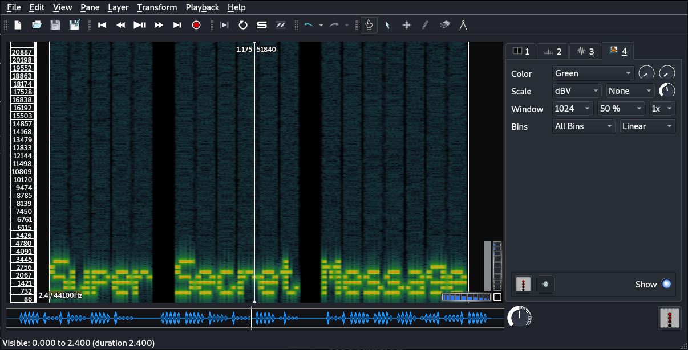

# c4ptur3-th3-fl4g

## Description
This room is a beginner level CTF, focusing on encoding methods, specrtograms, and data security. Let's begin!

# [Task 1] Translation & Shifting 

## Description
Translate, shift and decode the following. answers are all case sensitive.

## T1.1
Encrypted:

    c4n y0u c4p7u23 7h3 f149?

This one is just a simple character shifting.

Decrypted: `can you capture the flag?`

## T1.2
Encrypted:

    01101100 01100101 01110100 01110011 00100000 01110100 01110010 01111001 00100000 01110011 01101111 01101101 01100101 00100000 01100010 01101001 01101110 01100001 01110010 01111001 00100000 01101111 01110101 01110100 00100001

This one is binary. There a lot if online tools you can decode this with. I used [CyberChef](https://gchq.github.io/CyberChef/) for most of them.

Decrypted: `lets try some binary out!`

## T1.3
Encrypted:

    MJQXGZJTGIQGS4ZAON2XAZLSEBRW63LNN5XCA2LOEBBVIRRHOM======

Base32 encoded

Decrypted: `base32 is super common in CTF's`

## T1.4
Encrypted:

    RWFjaCBCYXNlNjQgZGlnaXQgcmVwcmVzZW50cyBleGFjdGx5IDYgYml0cyBvZiBkYXRhLg==

Base64 encoded

Decrypted: `Each Base64 digit represents exactly 6 bits of data.`

## T1.5
Encrypted:

    68 65 78 61 64 65 63 69 6d 61 6c 20 6f 72 20 62 61 73 65 31 36 3f

Hex encoded

Decrypted: `hexadecimal or base16?`

## T1.6
Encrypted:

    Ebgngr zr 13 cynprf!

ROT13 which is a simple letter substitution method.

Decrypted: `Rotate me 13 places!`

## T1.7
Encrypted:

    *@F DA:? >6 C:89E C@F?5 323J C:89E C@F?5 Wcf E:>6DX

This looked weird but still seems like letter substitution. It is ROT47.

Decrypted: `You spin me right round baby right round (47 times)`

## T1.8
Encrypted:

    - . .-.. . -.-. --- -- -- ..- -. .. -.-. .- - .. --- -.
    . -. -.-. --- -.. .. -. --.

The good old morse code. Like it's world war 1.

Decrypted: `TELECOMMUNICATION ENCODING`

## T1.9
Encrypted:

    85 110 112 97 99 107 32 116 104 105 115 32 66 67 68

Decimal it is.

Decrypted: `Unpack this BCD`

## T1.10
Encrypted:

    LS0tLS0gLi0tLS0gLi0tLS0gLS0tLS0gLS0tLS0gLi0tLS0gLi0tLS0gLS0tLS0KLS0tLS0gLi0tLS0gLi0tLS0gLS0tLS0gLS0tLS0gLi0tLS0gLS0tLS0gLi0tLS0KLS0tLS0gLS0tLS0gLi0tLS0gLS0tLS0gLS0t
    [REDACTED]
    LS0gLS0tLS0gLS0tLS0gLS0tLS0gLi0tLS0gLi0tLS0KLS0tLS0gLi0tLS0gLi0tLS0gLS0tLS0gLS0tLS0gLi0tLS0gLS0tLS0gLi0tLS0=

This one was a little bit of challenge. It can be decrypted by the following order:

Base64 > Morse Code > Binary > ROT47 > Decimal > readable English

Decrypted: `Let's make this a bit trickier...`

# [Task 2] Spectrograms

## Description
A spectrogram is a visual representation of the spectrum of frequencies of a signal as it varies with time. When applied to an audio signal, spectrograms are sometimes called sonographs, voiceprints, or voicegrams. When the data is represented in a 3D plot they may be called waterfalls.

## T2.1

First we downlaod the attached file (secretaudio.wav). We know that there is a hidden message inside it. I used a tool called `sonic-visualiser`. There are online tools for this purpose too which will do the job.

First we open the file from the tollbar. Then we go to "Layer" section and choose "Add Spectrogram". Then we zoom in to stretch it and now we can read the message inside it.

Answer: `Super Secret Message`

# [Task 3] Steganography

## Description
Steganography is the practice of concealing a file, message, image, or video within another file, message, image, or video.

## T3.1

After downloading the attached file (stegosteg.jpg), I used a tool called `steghide` which can extract the files inside an image or audio file. BY running `steghide --extract -sf stegosteg.jpg`, the hidden file inside the image (steganopayload2248.txt) would be revealed and it contains the answer.

Answer: `SpaghettiSteg`

# [Task 4] Security through obscurity 

## Description
Security through obscurity is the reliance in security engineering on the secrecy of the design or implementation as the main method of providing security for a system or component of a system.

## T4.1

Obviously we download the file first (meme.jpg). We can't extract anything from it, so I ran `strings` command on it which prints the sequences of printable characters in files and the answer was in the bottom of the output.

~~~
┌──(user㉿B0B)-[~/…/walkThroughs/thm/c4ptur3-th3-fl4g/files]
└─$ strings meme.jpg               
JFIF
"Exif

[REDACTED]

vA}=
*s&__
@9Xs
{@84
2$Es
i2Mc
IEND
"AHH_YOU_FOUND_ME!" 
hackerchat.png
~~~

Filename: `hackerchat.png`

## T4.2

This one's answer is right above were we found the previous answer.

Hidden text: `AHH_YOU_FOUND_ME!`

# D0N3! ; )

Hope you learned something. These methods are very common in CTF's and IRL, so knowing them can be useful some day.

BTW, have a nice one! : )
